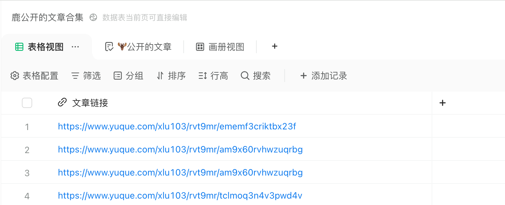
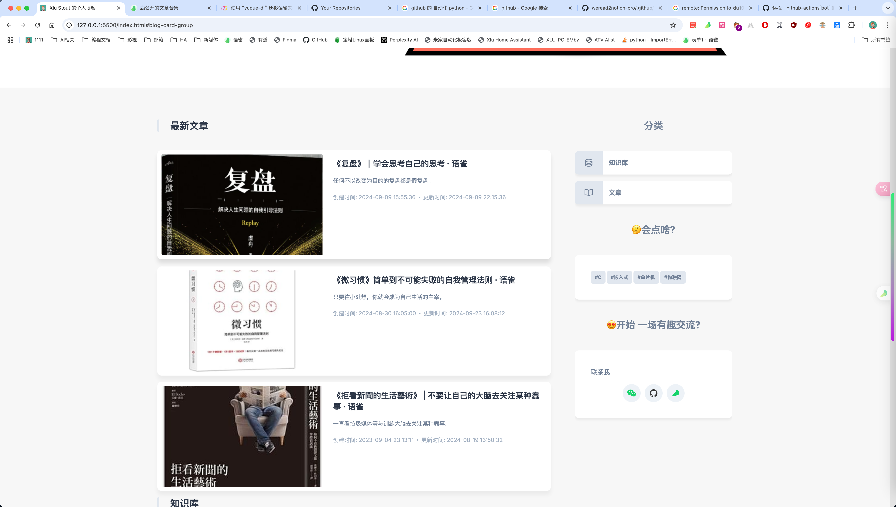

# XluBlog - 个人博客网站

基于 DevBlog 搭建的个人博客网站
DevBlog 是一个完全响应式的个人博客网站，适用于所有移动设备，拥有**深色和浅色主题**，使用 HTML、CSS 和 JavaScript 构建。

## 文章投稿

https://www.yuque.com/forms/share/93eaa0bc-5f14-4d4e-b265-91179c27f273

## 自动获取语雀中的文章进行博客更新

公开的文章：https://www.yuque.com/xlu103/re/qkxru83yf80cyhez

## 预览

## 许可证

<!--- 如果您不确定要使用哪个开放许可证，请访问 https://choosealicense.com/--->

此项目可免费使用，不包含任何许可证。
